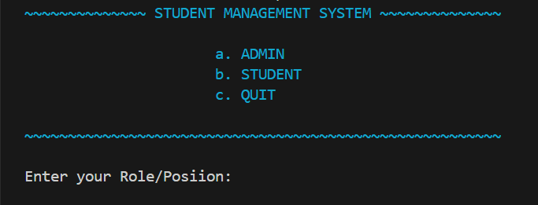

# Student Management System



## Project Description

The Student Management System is a console-based application that allows users to manage and edit student records. The system provides functionalities for both admin and student users. 

### Features

- **Admin**
  - Enter student records
  - Delete student records
  - View student profiles

- **Student**
  - View profile
  - Calculate fee with concessions
  - View timetable
  - Calculate CGPA

## Objectives

- To help administrators manage and edit student data efficiently.
- To provide students with access to their profiles, fee details, timetables, and CGPA calculations.
- To create a user-friendly interface with input validations for error-free operation.

## Target Users

- **Admin**: Can add, edit, and delete student records.
- **Students**: Can view their profile, calculate their fee and CGPA, and access their timetable.

## How to Use

1. **Clone the repository**:
    ```sh
    git clone https://github.com/SafiullahAamir/student-management-system.git
    cd student-management-system
    ```

2. **Compile the code**:
    ```sh
    g++ main.cpp Functions.cpp -o StudentManagementSystem
    ```

3. **Run the application**:
    ```sh
    ./StudentManagementSystem
    ```

### Admin Functionalities

- **Enter Students Records**: Admin can input student details including name, father's name, roll number, phone number, program, and section. The data is stored in an array.
- **Delete Students Records**: Admin can delete a student record by entering the roll number.
- **View Profiles**: Admin can view the profile of any student by entering the roll number.

### Student Functionalities

- **View Profile**: Students can view their profile by entering their roll number.
- **Fee Calculation**: Students can calculate their payable fee based on their degree and concession.
- **View Timetable**: Students can view their weekly timetable.
- **CGPA Calculator**: Students can calculate their CGPA by entering the GPA for each semester.

## Project Structure

- `main.cpp`: Contains the main function and menu-driven code to handle user interactions.
- `Functions.cpp`: Contains the implementation of functions for handling various operations.
- `Functions.h`: Header file containing function declarations.

## Contribution

Feel free to fork this repository, make changes, and submit pull requests. For major changes, please open an issue first to discuss what you would like to change.

## License

This project is licensed under the MIT License - see the [LICENSE](LICENSE) file for details.
